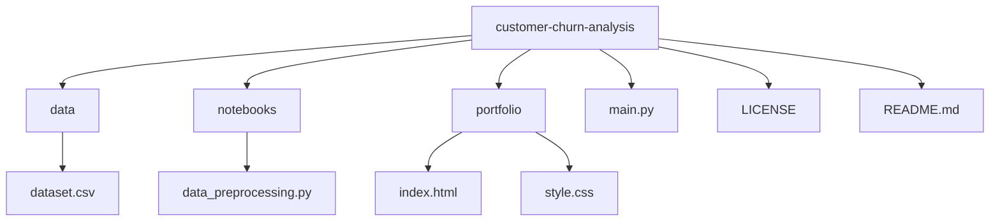

# Customer Churn Analysis and Prediction

## Overview
This project focuses on analyzing customer behavior and building a machine learning model to predict customer churn. The objective is to identify customers who are likely to stop engaging with the business and provide insights that can help improve retention strategies.

The dataset contains 6000 customer records with behavioral, transactional, and engagement-related features.

---

## Problem Statement
Customer churn is a critical issue for businesses as losing customers directly impacts revenue. The goal of this project is to:

- Analyze customer behavior patterns
- Identify key factors contributing to churn
- Build a predictive model to classify customers as churn or non-churn
- Provide actionable insights for business decision-making

---

## Dataset Description
The dataset includes the following types of features:

- Customer information: account age, loyalty status
- Transactional data: average order value, total orders
- Behavioral data: browsing frequency, cart abandonment rate
- Engagement metrics: engagement score, satisfaction score
- Other indicators: return rate, discount usage, price sensitivity

Target variable:
- Churn (1 = churned, 0 = active)

Churn was defined as customers with more than 90 days since their last purchase.

---

## Project Pipeline

### 1. Data Loading and Exploration
- Loaded dataset using pandas
- Checked data structure, types, and missing values
- Verified dataset quality (no missing values)

### 2. Data Cleaning
- Removed duplicate records
- Ensured consistency in data types

### 3. Feature Engineering
- Converted categorical variable (loyalty_member) into numeric form
- Created churn label based on inactivity (days_since_last_purchase > 90)
- Added derived features for improved modeling

### 4. Exploratory Data Analysis
- Analyzed churn distribution
- Visualized relationships between features and churn
- Generated correlation heatmap to identify key patterns

### 5. Model Building
- Split data into training and testing sets
- Trained a Random Forest classifier
- Prevented data leakage by removing days_since_last_purchase from model input
- Handled class imbalance using class weighting

### 6. Model Evaluation and Improvement
- Initially observed high accuracy due to data leakage, which was corrected
- After fixing leakage, model showed realistic performance
- Identified class imbalance issue (very few churn cases)
- Improved model by applying class weights to emphasize churn prediction
- Increased recall for churn detection from 61% to 68%

---

## Results

- Accuracy: 98%
- Precision (Churn): 87%
- Recall (Churn): 68% (improved from 61%)
- F1-score: 76%

The model demonstrates strong overall performance with improved ability to detect churn customers after handling class imbalance.

---

## Business Perspective

This analysis is designed to support business decisions by turning customer behavior data into retention actions. The insights help:

- Prioritize high-risk customers for targeted retention campaigns
- Allocate marketing budget toward engagement and satisfaction improvements
- Reduce revenue loss by identifying churn triggers early
- Improve lifetime customer value through proactive outreach

By focusing on engagement, satisfaction, and inactivity, this project delivers practical recommendations that can reduce churn and increase long-term profitability.

---

## Key Insights

- Customer engagement is the most significant factor influencing churn
- Customers with low engagement and low satisfaction are more likely to churn
- High inactivity strongly correlates with churn
- Pricing-related features have less impact compared to behavioral metrics
- Loyalty membership alone does not significantly reduce churn

---

## Feature Importance (Top Drivers)

- Engagement score
- Browsing frequency
- Average order value
- Cart abandonment rate
- Satisfaction score

---

## Technologies Used

| Category              | Tools / Libraries                |
|----------------------|---------------------------------|
| Programming Language | Python                          |
| Data Processing      | Pandas, NumPy                   |
| Visualization        | Matplotlib, Seaborn             |
| Machine Learning     | Scikit-learn (Random Forest)    |
| Development         | Jupyter Notebook, VS Code       |
---

## Project Structure

---

## Portfolio Website

A simple project portfolio page has been added in the `portfolio/` folder:

- `portfolio/index.html` — project overview page
- `portfolio/style.css` — styling for the page

Open `portfolio/index.html` in a browser to view the portfolio section for this customer churn analysis project.

---

## Model Improvement Strategy

Initial Issue:
- Model showed unrealistic performance due to data leakage

Action Taken:
- Removed leakage feature (days_since_last_purchase)
- Applied class weighting to handle imbalance

Result:
- Recall improved from 61% to 68%
- Model became more reliable for real-world use

---

## Conclusion

This project demonstrates a complete data science workflow, from data preprocessing to model building and business insight generation. The model improvement process highlights the importance of handling data leakage and class imbalance, resulting in a more reliable and practical churn prediction system.
